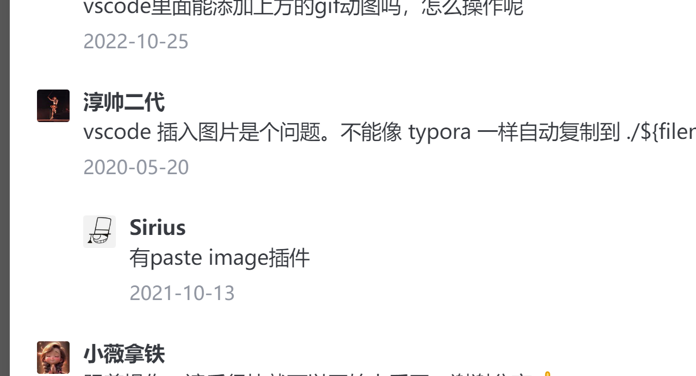

# 一级标题
## 二级标题
### 三级标题
正文

换行

代码块展示

```C
printf("hello world!");
```

行内代码``printf("hello")``

有序列表
1. A
   阿萨德教低价
2. B
   
   请问饿哦好饥饿且清洁噢好卫健委企鹅我去接哦

   我去交代我七点就哦
3. C
   大声说大阿斯顿

无序列表
- 爱仕达多
- 阿斯顿撒多所
  - 阿萨德祭扫
  - 爱仕达多所
  - 敖德萨所大
- 爱仕达大所多
  - asdad
  - 奥士达大厦
  - 阿萨德ad 

**加粗**

*倾斜*